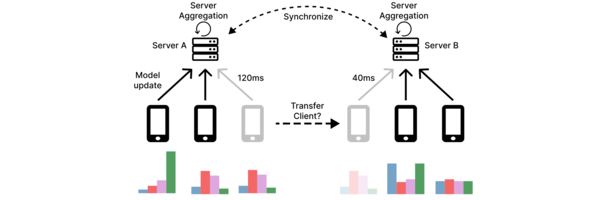

# Nomad: Asynchronous Multi-Server Federated Learning

[](https://www.python.org/downloads/release/python-390/) [](https://docs.conda.io/) 


A simulation framework for **Asynchronous Multi-Server Federated Learning (FL)** with support for multiple aggregation strategies, client-server configurations, and dataset settings.



---

## Requirements

Install required packages manually:

```bash
pip install torch==2.3.0 torchvision==0.18.0 torchaudio==2.3.0 --index-url https://download.pytorch.org/whl/cu118 torchdata==0.8.0
pip -r requirements.txt
```

If you get errors you can install `torchdata==0.7.1` but you'll have to make adjustment described here: [Github Issue](https://github.com/pytorch/pytorch/pull/122616/files)

Add to `torch/utils/data/datapipes/utils/common.py
` on line 23.

```python
# BC for torchdata
DILL_AVAILABLE = dill_available()
```
---

## Running Linters

### Running Ruff

```bash
ruff check .
# Or automatically fix problems
ruff check --fix .
```

### Running Black

```bash
black --check .
```

### Running Mypy

```bash
mypy .
```

## Running Experiments

### Local Run

```bash
python3 -m mobilefl comm100_mnist --print  # Verbose mode
python3 -m mobilefl comm100_mnist          # Quiet mode
```

### DAS-6 Cluster

* Ensure conda env is installed on **scratch**
* Load GPU module:

```bash
module load cuda11.2/toolkit
```

When you run new experiments, please check the configuration that "speed_flag" is not appeared, otherwise, you should rewrite the config file just as the example file that is shown before. And also please delete the `config_client_idcs.json` file.

#### Test Example

```bash
python3 -m mobilefl example1 --print
```

#### With WandB Logging

```bash
wandb login
python3 -m mobilefl example1 --print --wandb
```

#### Detached Run

```bash
nohup python3 -m mobilefl example1 --print --wandb > debug.out &
```

#### Using Scripts

```bash
bash ./runDas.sh example         # Test config
nohup bash ./runDas.sh example1 -y > debug.out &  # Confirmed run
```

---

## Creating New Configurations

1. Create folder: `./configurations/<NewConfig>`
2. Copy an existing `config.json` into it.
3. Edit parameters:

   * `"result_file"`: Output directory under `./results/`
   * `"name"`: Name of the experiment (used in paths)

Example:

```bash
./configurations/cifar10/config.json
```

Then run:

```bash
python3 -m mobilefl cifar10 --print
```

Run multiple experiments like `FedAsync`, `MultiAsync`, `FedAvg` by changing the `"name"` field and other algorithm-specific parameters.

Note: Make sure to also create world config files.

### Keeping Same Clients

```bash
python3 -m mobilefl.generate_client.py 100 client100
```

This creates `./client100.pkl` to reuse fixed clients.

---

## Plotting Results

```bash
python3 -m mobilefl.plot cifar10
python3 -m mobilefl.plot cifar10 FedAsync MultiAsync
python3 -m mobilefl.plot80 145000 45000 comm100_cifar MultiAsync MultiSync FedAsync HierFAVG FedAvg
python3 -m mobilefl.plotq 300 200 cifar10 FedAsync MultiAsync qlen
```

Log details are in `./log_tools/`.

---

## Adding New Datasets

* Add dataset logic in: `./data/data.py`
* Add model in: `./models/`
* Modify aggregation logic in: `./models/aggregator.py`

---

## Key Configuration Parameters

| Parameter                        | Description                                            |
| -------------------------------- | ------------------------------------------------------ |
| `name`                           | Name of the experiment                                 |
| `dataset`                        | `mnist`, `fmnist`, `cifar`                             |
| `num_rounds`                     | Number of local updates or communication rounds        |
| `alpha`                          | Dirichlet distribution parameter                       |
| `server_iid`, `client_iid`       | IID control at server and client level                 |
| `num_servers`, `num_clients`     | Number of servers and clients                          |
| `server_X_clients`               | % of clients assigned to each server                   |
| `server_X_training_delay`        | Avg speed (latency) of each server's clients           |
| `client_async`                   | Whether clients update asynchronously                  |
| `server_async`                   | Only true for MultiAsync                               |
| `sync_period`                    | Synchronization period for MultiSync (null for others) |
| `decay_start`                    | Decay start point (0.8 or 9999 depending on algorithm) |
| `agr`                            | Aggregation rule (`fedsgd`, `fedavg`)                  |
| `leader`                         | True only for HierFAVG                                 |
| `hier_period`                    | Hierarchical sync interval                             |
| `client_fraction_per_round`      | For FedAvg only (e.g., 0.2 for 20%)                    |
| `cuda`, `cuda_to_use`            | GPU usage flags                                        |
| `num_local_epochs`, `batch_size` | Local training hyperparameters                         |
| `aggregation_buffer_size`        | For FedAsync, buffer size (usually 1)                  |

---

## Reproducing Results

### CIFAR-10

Run all experiments:

```bash
./runAll.sh cifar <ResultFolderName>
```

Plot results:

```bash
./plotAll.sh <time> <updates> <ResultFolderName>
```

* Sliding window size: 100 (edit in `plot.py`, line 466)

### MNIST

```bash
./runAll.sh mnist <ResultFolderName>
./plotAll.sh <ResultFolderName> <time> <updates>
```

## Citation

If you use this code in your research or project, please cite the following papers.

Spyker (Middleware 2024):
```bibtex
@article{yuncong2024spyker,
  title={Spyker: Asynchronous Multi-Server Federated Learning for Geo-Distributed Clients},
  author={Yuncong Zuo and Bart Cox and Lydia Y. Chen and J{\'{e}}r{\'{e}}mie Decouchant},
  journal={Middleware 2025},
  year={2024},
  url          = {https://doi.org/10.1145/3652892.3700778},
  doi          = {10.1145/3652892.3700778},
}
```
For more details, you can access the Spyker paper at https://doi.org/10.1145/3652892.3700778

Nomad (NCA 2025):
```bibtex
@INPROCEEDINGS {11261552,
author = { Cox, Bart and Chen, Lydia Y. and Decouchant, Jeremie },
booktitle = { 2025 23rd International Symposium on Network Computing and Applications (NCA) },
title = {{ Nomad: Accelerating Geo-distributed Learning with Client Transfers }},
year = {2025},
month = {Nov}
pages = {1-8},
doi = {10.1109/NCA67271.2025.00014},
url = {https://doi.ieeecomputersociety.org/10.1109/NCA67271.2025.00014},
publisher = {IEEE Computer Society}
}
```
For more details, you can access the Nomad paper at https://doi.ieeecomputersociety.org/10.1109/NCA67271.2025.00014

---

For any questions or issues, please refer to each module's README or contact the maintainers.

Happy Federated Learning! 🤖
